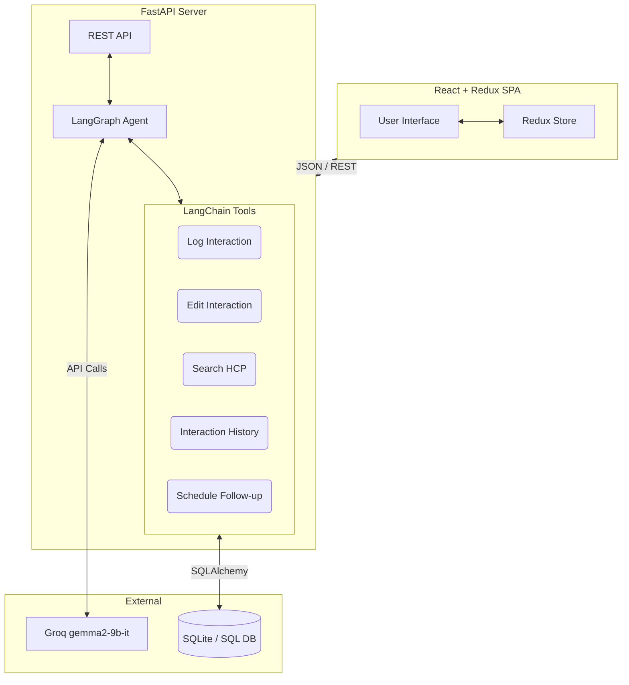

# AI-First HCP CRM

A fully functional, AI-powered Customer Relationship Management (CRM) prototype designed for pharmaceutical field representatives to seamlessly log and manage interactions with Healthcare Professionals (HCPs). 

This project demonstrates a modern architecture combining a polished React frontend with an intelligent FastAPI backend orchestrated by LangGraph.

## Project Overview

Field representatives often spend too much time on manual data entry. This AI-First CRM solves that by offering two modes:
1. **Structured Form Mode:** A clean, manual entry form for standard logging.
2. **AI Chat Mode:** An intelligent conversational interface where reps can simply describe an interaction (e.g., *"Met Dr. Sharma today to discuss new trial... "*). The LangGraph agent extracts structured fields and automatically executes database operations using tools.

## Architecture Diagram



## Tech Stack

* **Frontend:** React (Vite), Redux Toolkit, Vanilla CSS (Premium dark mode UI), Lucide Icons
* **Backend:** FastAPI, SQLAlchemy, Pydantic
* **AI Orchestration:** LangGraph, LangChain
* **LLM Provider:** Groq (`gemma2-9b-it`)
* **Database:** SQLite (SQLAlchemy ORM, fully compatible with PostgreSQL/MySQL)
* **Typography:** Google Inter

## Folder Structure

```
├── backend/
│   ├── main.py          # FastAPI application & error handling
│   ├── agent.py         # LangGraph state machine & system prompts
│   ├── tools.py         # 5 LangChain tools for database operations
│   ├── database.py      # SQLAlchemy setup
│   ├── models.py        # Database schema
│   ├── schemas.py       # Pydantic validation models
│   ├── seed.py          # Script to seed initial HCP data
│   └── requirements.txt
└── frontend/
    ├── src/
    │   ├── components/  # React UI components (Chat, Form, Search, History)
    │   ├── store/       # Redux slices (ui, hcp, interaction)
    │   ├── App.tsx      # Main layout
    │   ├── main.tsx     # Entry point
    │   └── index.css    # Global styles & animations
    ├── package.json
    └── vite.config.ts
```

## How to Run

### 1. Backend Setup

1. Navigate to the backend directory:
   ```bash
   cd backend
   ```
2. Create and activate a virtual environment:
   ```bash
   python -m venv venv
   source venv/bin/activate  # Windows: .\venv\Scripts\activate
   ```
3. Install dependencies:
   ```bash
   pip install -r requirements.txt
   ```
4. Configure your API Key:
   Create a `.env` file in the `backend/` directory:
   ```env
   GROQ_API_KEY=your_groq_api_key_here
   ```
5. Seed the database (creates tables and initial HCPs):
   ```bash
   python seed.py
   ```
6. Run the server:
   ```bash
   uvicorn main:app --reload --port 8000
   ```

### 2. Frontend Setup

1. Open a new terminal and navigate to the frontend:
   ```bash
   cd frontend
   ```
2. Install dependencies:
   ```bash
   npm install
   ```
3. Run the development server:
   ```bash
   npm run dev
   ```
4. Open `http://localhost:5173` in your browser.

## API Endpoints

* `GET /api/hcps` - List all HCPs
* `POST /api/hcps` - Create a new HCP
* `GET /api/hcps/{id}/interactions` - Get history for a specific HCP
* `POST /api/interactions` - Manually log a new interaction
* `PUT /api/interactions/{id}` - Update an existing interaction
* `POST /api/agent/chat` - Interact with the LangGraph AI Agent

## LangGraph Workflow & Tools Explained

The AI Agent acts as an intelligent router. When a user submits a natural language message, the agent (powered by `gemma2-9b-it`) determines intent and utilizes one or more of the following tools:

1. **`log_interaction`**: Extracts fields (type, summary, topics) and persists a new interaction to the database.
2. **`edit_interaction`**: Identifies an interaction ID and applies modifications described by the user.
3. **`search_hcp`**: Queries the DB by name/specialty. If a rep mentions "Dr. Sharma" without selecting an ID, the agent automatically uses this tool to resolve the ID first.
4. **`get_interaction_history`**: Fetches past interactions to answer contextual questions.
5. **`schedule_followup`**: Generates a linked follow-up task and due date.

## Future Improvements

* **Authentication:** Implement JWT-based auth to track interactions per-rep.
* **Production Database:** Migrate the SQLAlchemy connection string from SQLite to PostgreSQL.
* **Analytics Dashboard:** Add a view to track interaction frequency and common discussion topics.

## Troubleshooting

* **"Database error / no such table"**: Ensure you have run `python seed.py` before starting the backend server.
* **"AI Service unavailable"**: Check your `backend/.env` file to ensure the `GROQ_API_KEY` is valid and active.
* **"Failed to fetch" on Frontend**: Ensure the FastAPI server is running on port 8000.
