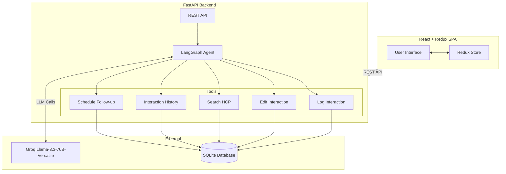

# AI-First HCP CRM

An AI-powered Customer Relationship Management (CRM) prototype designed for pharmaceutical field representatives to efficiently log, manage, and review interactions with Healthcare Professionals (HCPs).

The application combines a modern React frontend with a FastAPI backend and a LangGraph-powered AI agent that enables users to either manually log interactions or simply describe them using natural language.

---

# Project Overview

Pharmaceutical sales representatives spend a significant amount of time manually documenting meetings with doctors after every visit. This project demonstrates how AI can simplify that workflow while maintaining structured CRM records.

The application supports two interaction modes:

### 1. Structured Form Mode
Users manually fill in interaction details such as:

- Interaction Type
- Summary
- Topics Discussed
- Requested Action
- Follow-up Date

---

### 2. AI Chat Mode

Users can describe an interaction naturally, for example:

> "I met Dr. Patel today. We discussed the latest hypertension treatment. He requested clinical trial reports. Schedule a follow-up next Friday."

The LangGraph agent automatically:

- Understands the user's intent
- Extracts structured information
- Selects the appropriate backend tool
- Stores the interaction in the SQL database
- Returns a confirmation response

---

# System Architecture



---

# Tech Stack

## Frontend

- React (Vite)
- Redux Toolkit
- TypeScript
- Vanilla CSS
- Google Inter Font
- Lucide Icons

---

## Backend

- FastAPI
- SQLAlchemy ORM
- Pydantic

---

## AI

- LangGraph
- LangChain
- Groq
- Llama-3.3-70B-Versatile

---

## Database

- SQLite
- SQLAlchemy ORM

The database layer can easily be migrated to PostgreSQL or MySQL with minimal changes.

---

# Key Features

- AI-powered conversational interaction logging
- Traditional structured form workflow
- LangGraph-based intelligent agent orchestration
- Five specialized backend tools
- Automatic extraction of structured CRM fields
- HCP search functionality
- Interaction history management
- Follow-up scheduling
- Edit existing interactions
- SQL database persistence
- Responsive enterprise-style interface

---

# Folder Structure

```
ai-first-hcp-crm
│
├── backend
│   ├── main.py
│   ├── agent.py
│   ├── tools.py
│   ├── models.py
│   ├── schemas.py
│   ├── database.py
│   ├── seed.py
│   ├── requirements.txt
│   └── .env.example
│
├── frontend
│   ├── src
│   │   ├── components
│   │   ├── store
│   │   ├── App.tsx
│   │   ├── main.tsx
│   │   └── index.css
│   │
│   ├── package.json
│   └── vite.config.ts
│
└── README.md
```

---

# Installation

## Backend

Navigate to the backend folder.

```bash
cd backend
```

Create a virtual environment.

```bash
python -m venv venv
```

Activate it.

Windows

```bash
.\venv\Scripts\activate
```

Linux / macOS

```bash
source venv/bin/activate
```

Install dependencies.

```bash
pip install -r requirements.txt
```

Create a `.env` file.

```env
GROQ_API_KEY=your_groq_api_key_here
```

Seed the database.

```bash
python seed.py
```

Run the backend.

```bash
uvicorn main:app --reload
```

---

## Frontend

Navigate to the frontend.

```bash
cd frontend
```

Install dependencies.

```bash
npm install
```

Run the application.

```bash
npm run dev
```

Open

```
http://localhost:5173
```

---

# API Endpoints

## HCP

```
GET /api/hcps
```

Retrieve all Healthcare Professionals.

---

```
POST /api/hcps
```

Create a new Healthcare Professional.

---

## Interaction

```
GET /api/hcps/{id}/interactions
```

Retrieve interaction history.

---

```
POST /api/interactions
```

Create a new interaction.

---

```
PUT /api/interactions/{id}
```

Update an existing interaction.

---

## AI Agent

```
POST /api/agent/chat
```

Send a natural language request to the LangGraph AI Agent.

---

# LangGraph Agent Workflow

The LangGraph agent acts as the intelligent decision-making layer of the application.

When a user submits a message through the AI Chat interface:

1. FastAPI receives the request.

2. The request is forwarded to the LangGraph agent.

3. The language model analyzes the user's intent.

4. The agent determines which backend tool should execute.

5. The selected tool performs the database operation.

6. FastAPI returns the result to the frontend.

This architecture separates AI reasoning from business logic, making the application modular, maintainable, and scalable.

---

# LangGraph Tools

## 1. Log Interaction

Creates a new interaction from either the structured form or AI chat.

The LLM extracts:

- Interaction Type
- Summary
- Topics Discussed
- Requested Action
- Follow-up Date

The tool then stores the interaction in the SQL database.

---

## 2. Edit Interaction

Allows users to modify existing interaction records while preserving other stored information.

---

## 3. Search HCP

Searches Healthcare Professionals by name or specialty.

Used whenever the system needs to identify an HCP before logging interactions.

---

## 4. Get Interaction History

Retrieves previous interactions associated with an HCP.

This provides additional context before new interactions are recorded.

---

## 5. Schedule Follow-up

Creates follow-up tasks linked to interactions and stores reminder dates inside the database.

---

# Future Improvements

- JWT Authentication
- Role-based Access Control
- PostgreSQL Deployment
- Docker Support
- Analytics Dashboard
- Email Notifications
- Calendar Integration
- AI-generated Meeting Summaries
- Multi-user Support

---

# Troubleshooting

### AI Service Unavailable

Verify your Groq API key inside:

```
backend/.env
```

---

### Database Errors

Run:

```bash
python seed.py
```

to recreate tables and sample HCP records.

---

### Frontend Cannot Connect

Ensure the FastAPI backend is running before starting the frontend.

---

# Author

**Jay Patel**

AI-First HCP CRM Prototype

Built using React, Redux, FastAPI, LangGraph, Groq LLM, SQLAlchemy, and SQLite.
